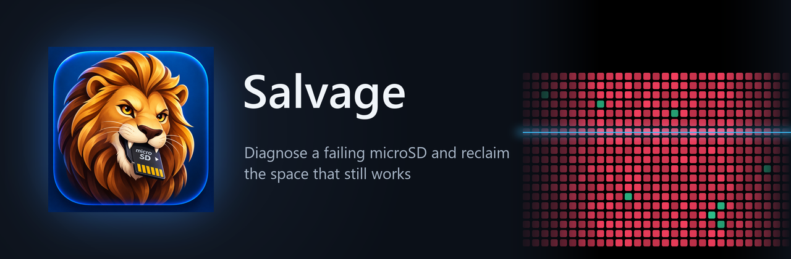
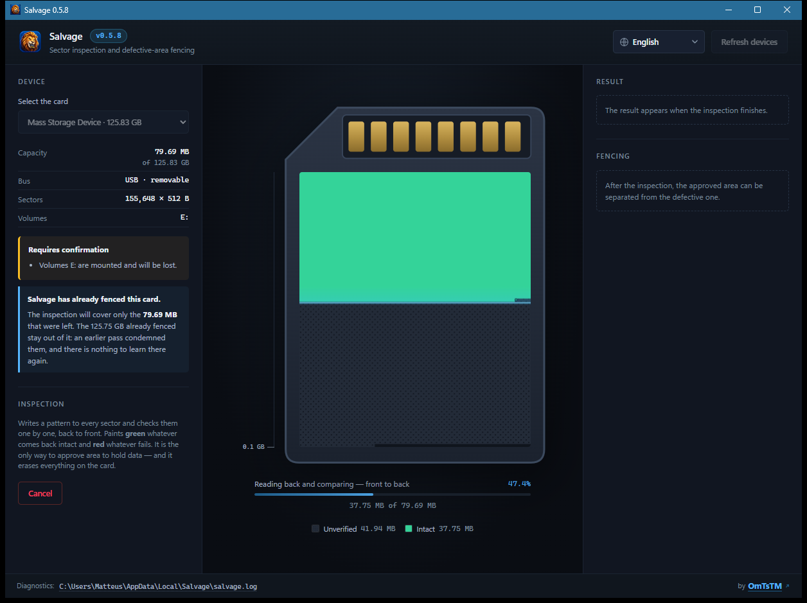
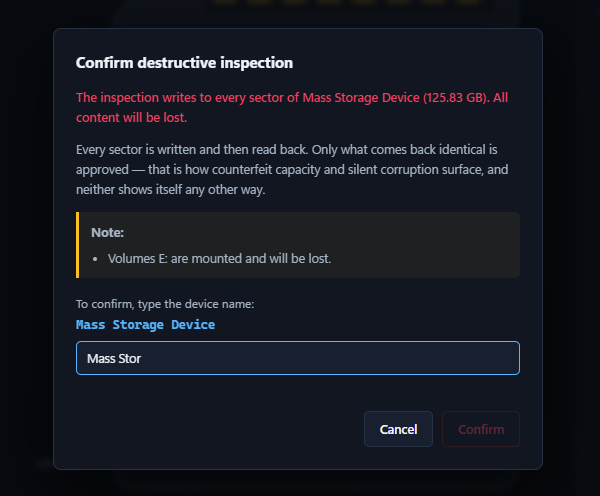
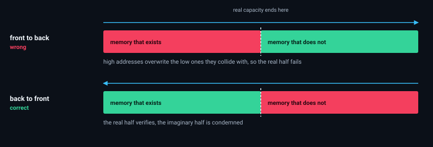
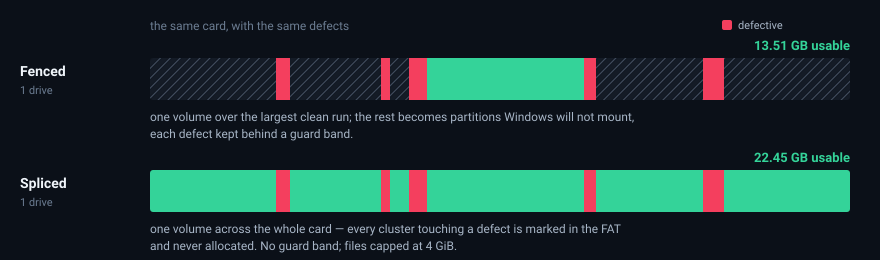
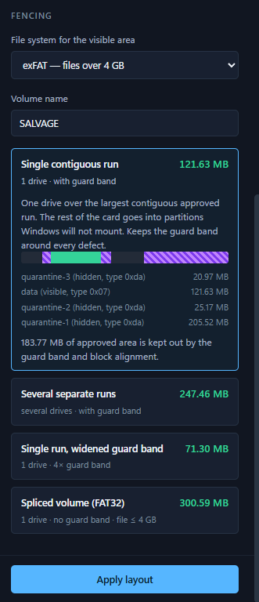
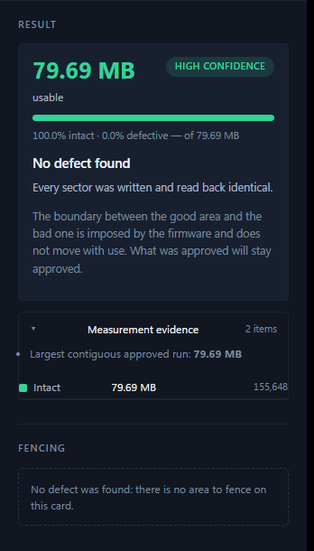

<p align="center">
  
</p>

<h1 align="center">Salvage</h1>

<p align="center">
  <strong>Diagnose a failing microSD card and reclaim the space that still works.</strong>
</p>

<p align="center">
  <a href="../../releases/latest"></a>
  <a href="../../actions/workflows/ci.yml"></a>
  <a href="LICENSE"></a>
  
  
  <a href="https://ko-fi.com/omtstm"></a>
</p>

---

Salvage inspects flash media sector by sector, works out **why** it fails, and
fences the defective regions into partitions Windows will not mount — leaving a
visible partition backed only by area that was verified byte for byte.

> [!IMPORTANT]
> The space Salvage reclaims is real, but it is not guaranteed. Read
> [What can honestly be promised](#what-can-honestly-be-promised) before trusting
> a card with anything you would miss.

<p align="center">
  
</p>

<p align="center">
  <em>Reading back and comparing, front to back. The area painted green came
  back byte-identical to what was written; everything below the sweep is still
  unverified, and is reported as such rather than assumed.</em>
</p>

<p align="center">
  
</p>

<p align="center">
  <em>Nothing is written until the operator has typed the name of the disk they
  are about to erase. Consent is a type, obtainable only from the function that
  evaluates the safety guards — so no code path can reach a write without
  passing through them.</em>
</p>

## Contents

- [Install](#install)
- [What can honestly be promised](#what-can-honestly-be-promised)
- [How the inspection works](#how-the-inspection-works)
- [Reclaiming the space](#reclaiming-the-space)
- [Building from source](#building-from-source)
- [Architecture](#architecture)
- [Testing](#testing)
- [Accessibility](#accessibility)
- [Limitations](#limitations)
- [Support](#support)

---

## Install

Download the installer from the [latest release](../../releases/latest) and run
it. Nothing has to be installed first and no internet connection is needed: the
installer carries the WebView2 runtime the window renders with.

That runtime is why the installer is around 210 MB for a 4 MB program. It is the
price of being genuinely self-contained, and it is paid only at install time.

A **portable** `Salvage-x.y.z-portable.exe` (about 4 MB) is published alongside
it for people who would rather not install anything. It is the same program, but
it relies on the WebView2 runtime already being present — which it is on Windows
11, and on any Windows 10 that has taken updates since 2021.

Salvage needs **Administrator** privileges: raw disk access is not available to a
normal user. The shortcut requests elevation on launch, so Windows asks on every
start. That prompt is expected.

The interface speaks **Portuguese, English, Spanish and Chinese**, chosen from
the system language. Anything else falls back to English rather than to the
language it was first written in.

> [!NOTE]
> Windows SmartScreen will warn about an unrecognised publisher. The build is not
> code-signed — a certificate costs money and this is a free tool. Choose
> **More info → Run anyway**, or build it yourself from source below.

---

## What can honestly be promised

An SD card does not expose physical memory. Between the address the host asks
for and the NAND cell that answers sits a controller running a **Flash
Translation Layer**: it performs wear levelling, retires failing blocks, and
remaps addresses on every write. The mapping that holds today is not the mapping
that will hold tomorrow.

"Isolating bad sectors" therefore cannot be sold as a guarantee. What Salvage
does instead is identify which failure a card has, and only then state how far
the result can be trusted.

| Scenario | What is happening | Does fencing help? |
|---|---|---|
| **Counterfeit capacity** | The controller advertises more memory than exists and serves address `L` from cell `L mod C`. The boundary is set by firmware, not wear. | **Yes, permanently.** The boundary does not move with use. |
| **Spare blocks exhausted** | The reserve the controller used to replace dying cells ran out; defects froze onto fixed addresses. | Mitigates well, but the card is near end of life. Keep a copy. |
| **Actively degrading** | Sectors that passed one pass fail the next. | **No.** Tomorrow's bad sectors do not exist yet. |

There is deliberately no "guaranteed" assurance level. `Assurance` is an enum
whose best variant is `High`, so the ceiling is a property of the type rather
than a habit of phrasing — and since the window words each level from a table
keyed by the variant's own identifier, there is no free text anywhere that could
drift into a promise. Adding one would be a deliberate edit to the domain, not a
slip.

---

## How the inspection works

There is one mode, and it is destructive. Every sector is written with a
self-identifying pattern back to front, then read and compared front to back.

### The pattern carries its own address

A naive test writes random data and checks it reads back unchanged. That catches
read and write errors, but it is blind to the defect that destroys the most
data: on a counterfeit card, writing and re-reading the same address always
agrees, because the aliasing is *consistent*. The card passes, then eats the
user's files.

Salvage writes into every sector a header containing that sector's own address, a
session nonce, and a checksum binding them. When the device returns another
address's contents, the header names **which** address came back — and the true
capacity follows by deduction.

### Write order decides whether the diagnosis is right or inverted

On a counterfeit card several addresses share one cell, and whoever writes last
decides what is read.

Writing front to back, high addresses overwrite the low ones they collide with.
On read-back the **low** addresses — the ones that genuinely exist — come back
altered, while the high, nonexistent ones return exactly what was just written
and **pass**. The diagnosis inverts: the good area is condemned and the
nonexistent area approved.

The write pass therefore walks the device **back to front**.

<p align="center">
  
</p>

### Acceptance is not retention, and the scan says which it measured

Reading back after writing measures whether the cell *accepted* the data and
gave it back. It does not measure whether the cell still holds it tomorrow. A
worn cell answers the first question correctly and the second badly, and that is
how a card passes an inspection and loses files overnight. A card tested during
development accepted all 245 million writes without one failure, then lost 99.9%
of them.

So the verdict states the interval it actually measured, rather than implying
durability it did not. Because the write pass travels back to front and the
verify pass front to back, the sector written last is verified first and the
sector written first is verified last: those two are the extremes and every
other sector falls between them, so the bounds come out of four clock readings
with no assumption about the rate. On a 252 GB run they were a quarter of a
second and two hours.

Answering the longer question takes a second visit, days later — see
[Re-checking what it still holds](#going-back-and-not-starting-over).

### Large blocks, sufficient precision

Scanning sector by sector across 128 GB is impractical. Salvage works in 4 MiB
blocks and, when one fails, refines by bisection down to 128 KiB — not to the
individual sector. The extra precision would cost hundreds of times more I/O and
change nothing: planning dilates every condemned region by a guard band and
aligns it to the erase block anyway. The rounding always errs toward safety.

### No system cache

Devices are opened with `FILE_FLAG_NO_BUFFERING`. This is a **correctness**
requirement, not an optimisation: with the Windows cache in the path, a read
issued after a write can be served from RAM without ever reaching the card, and
aliasing would never be detected.

### Offering to stop, without making the prediction

Once a gigabyte of unbroken damage has gone past, the window offers to stop. A
sector that fails takes far longer to fail than a good one takes to pass — the
card behind this work read its damaged half at 5 MB/s against 23 MB/s writing —
so the remaining hours are spent confirming what already looks certain.

What it must not do is say the rest of the card is bad. It has not looked, and
the one thing this program exists not to do is report what it did not measure.
So the note states three measured facts — where the damage began, what stopping
preserves, and what stopping gives up — and leaves the inference to the person,
who is entitled to make it.

Stopping costs no usable space: unexamined area is withheld from data exactly as
failed area is, so the approved total is identical either way. What it costs is
the diagnosis. A card lying about its capacity gives itself away in the tail,
and area surviving past the damage would be found there too. The note says both,
because "cancel" otherwise reads as abort and nobody presses it believing they
will keep what is already proven.

---

## Reclaiming the space

After the diagnosis, Salvage computes partition layouts and writes the MBR
directly. Two mechanisms are offered, differing in the layer that keeps data off
defective sectors — not in whether they do.

### Fencing with partition boundaries

- The **visible partition** (exFAT or FAT32) covers approved area only.
- **Quarantine partitions** use MBR type `0xDA` (non-FS data), which Windows
  neither mounts nor displays — and which, appearing as allocated space, stops
  another tool from offering the region as free.
- Every condemned region is dilated by a **guard band** and aligned outward to
  the erase block, because neighbouring cells degrade together.
- MBR was chosen over GPT deliberately: readers in cameras, consoles and older
  devices commonly understand only MBR.

### Splicing with the allocation table

A partition is an interval: a start address and a length. There is no way to
express "a partition made of scattered pieces", so fencing can only ever hand
back the largest single run — everything between the defects is lost.

A filesystem has no such limit. FAT32 reserves the entry value `0x0FFFFFF7` for
defective clusters, and no driver on any operating system allocates one. Salvage
builds the table itself: a single volume spans the whole usable area, every
cluster touching an unapproved sector is marked, and the good runs arrive as
**one drive letter whose free space is their sum**.

What it costs is the margin. Fencing dilates each condemned region by a guard
band; a cluster map marks exactly the cells that failed and leaves their
neighbours allocatable. FAT32 also caps a single file at 4 GiB. The interface
prints both costs next to the option rather than only the larger number.

<p align="center">
  
</p>

<p align="center">
  
</p>

<p align="center">
  <em>Every layout states what it costs beside what it yields, because the
  option that recovers the most space is also the one that gives up the guard
  band — and the larger number should not win by default. The panel above is
  the running program, driven from a reconstructed sector map: a card that
  fails this particular way was not on hand, and a screenshot is not a place
  to imply one was.</em>
</p>

### What a result looks like

<p align="center">
  
</p>

This is the same card as the banner — the one that came back 99.9% destroyed —
re-inspected after fencing. The 79.69 MB that survived were written and read
back identical, every sector. The 125.75 GB already condemned stayed out of the
run: an earlier pass settled them, and there is nothing to learn there again.

That is the whole claim, and its limit: the tool does not repair anything. It
finds what still works, proves it, and puts a boundary around it.

### Going back, and not starting over

Fencing was a one-way door: a card given a layout was limited to the sliver that
survived, permanently. Three things address that, and all are shaped by the same
rule as everything else.

**Releasing a card** restores its full capacity. The table it arrived with is
captured the first time this program overwrites one — 512 bytes, kept beside the
log — so the way back leads to the card's own layout rather than a guess at it.

It is not an undo. The pattern went over every sector long before any layout
existed, so the original contents are gone either way; and what it removes is
the *protection*, not the damage. A card fenced because most of it is dead comes
back as one full-size volume that will accept files and lose them. That is a
legitimate thing to want — to re-inspect the whole card differently, to try
another tool, to be rid of it — and the confirmation says exactly that before
asking.

**Remembering a card** stores the sector map after an inspection, keyed to the
card's fingerprint. Re-selecting it later shows what was found and how long ago,
and adopting that record brings the diagnosis and the layouts back without
repeating the hours.

A record is **a map of where to look, never a certificate**. Adopting one
approves nothing: `verified_now` stays false, and the apply path refuses to
write a data partition until the area has been read back today. That
re-verification is not a weaker scan — it is the same test aimed only at the
sectors about to be used. A defect that appeared outside the approved area
changes nothing, because that area was already condemned; a defect that appeared
inside it is precisely what the re-verification finds.

**Re-checking what it still holds** is the second visit the inspection itself
cannot make. It re-reads the approved area and compares each sector against the
pattern the earlier scan wrote there, and so answers the question that matters
after a card has sat for a week: is the data still in the cells?

It writes nothing. The device is opened `Access::Read`, so that is the operating
system's guarantee rather than a promise in a comment — which is also why it is
the one destructive-looking button on the screen that asks for no typed name.
There is nothing to consent to. It needs the seed, because the expected content
of a sector is computed from the nonce and the sector's own address, so a record
written before the seed was stored simply does not offer the check rather than
running it against a guess.

Sectors carrying **no recognisable header at all** are counted apart from
corrupt ones, and that separation is the whole safety of the feature. One such
sector is severe retention loss; most of the area answering that way means
something else wrote to the card since. The two are indistinguishable from
inside a sector, so the window reports that the pattern is gone and claims
neither reading. Without it, re-checking a card that had been formatted would
have condemned 235 GB of healthy flash.

What it measures merges onto the stored map rather than replacing it: the
re-read covers only the approved area, and adopting it wholesale would mark the
condemned half untested and turn a diagnosis into "nothing proven". What was
re-measured overwrites; what was not looked at keeps standing. `verified_now`
then becomes true, which is the gate above stated in the other direction — the
area a layout would use has been read back today.

### When the card turns out to be fine

An inspection writes its pattern over every sector, so a card leaves it erased
and unpartitioned whatever the verdict. A card with defects then flows into a
layout, which ends by formatting the volume it created. A card with none had
nowhere to flow: nothing to fence, therefore nothing offered, and the best
possible result was the only one that handed back an unusable card.

**Preparing a card** is that missing step — one partition across the full
capacity, formatted, named. It is offered only where nothing was condemned.
Where defects exist, the same partition table is what *releasing* writes, and
the difference is the claim attached to it: one hands back capacity that was
proven, the other hands back capacity known to lose files. Presenting the second
as "format the card" would dress that up as a convenience.

Above 32 GB, `format.com` refuses to make a FAT32 volume and says so only after
being asked — by which point the partition table is already written. Past that
size the filesystem is written directly instead, by the same code the spliced
strategy uses, which has no such limit. Below it the Windows formatter is left
to do its job.

Measured on a 252.87 GB card: inspected in 1h58 with no defect in 493,895,680
sectors, then given a single FAT32 volume of 235.45 GiB — 7.4 times the largest
Windows will create. `chkdsk` audits it as sound, across 7,715,107 allocation
units, and a 2 GiB file written and read back matches byte for byte.

The step stays a step, because it is two choices the program cannot make for
anyone. The filesystem is not a technical detail — FAT32 caps a file at 4 GiB
and is what a car stereo reads; exFAT has no cap and breaks older hardware — and
size does not settle it, since a 64 GB card can still be going into something
that only reads FAT32. And formatting destroys the pattern the inspection wrote,
which is the reference the retention re-check compares against: doing it
automatically would close off, on exactly the healthy cards, the one measurement
that answers whether a card holds data overnight.

What it does instead is guess well and say what is at stake. The menu opens on
FAT32 below 32 GiB and exFAT above — Windows' own FAT32 ceiling, which is where
the question changes shape — and touching it stops the guessing for that card.
And closing the window with a card left erased now asks, rather than letting
Windows be the one to say "you need to format this disk", which above the
ceiling steers toward exFAT and away from the one thing this program can still
do. The prompt names that, and only above the ceiling where it is true. Closing
anyway stays one click.

### The invariant everything rests on

> No user data may ever land on a sector that was not explicitly approved.

Excluding failed sectors is not enough: **never-inspected sectors stay out too**,
because absence of proof is not proof of absence.

`PartitionPlan::validate` enforces it and is called again immediately before
writing. It checks whichever mechanism the plan declares: for a fenced layout,
that the interval contains nothing but approved sectors; for a spliced one, that
the allocation table can actually express the exclusion — which fails when a
defect lands in the boot sector, the tables or the root directory, because those
have no alternative home.

Safety, privilege and dependency policy are documented separately in
[SECURITY.md](SECURITY.md).

---

## Building from source

### Prerequisites

| Requirement | Why | Install |
|---|---|---|
| **Windows 10/11 (x64)** | The infrastructure layer is Win32-specific | — |
| **Rust 1.82+** | Toolchain | [rustup.rs](https://rustup.rs) |
| **Visual Studio Build Tools** | The MSVC linker Rust uses on Windows | [Build Tools](https://visualstudio.microsoft.com/downloads/) → "Desktop development with C++" |
| **WebView2 Runtime** | Renders the window. Preinstalled on Windows 11 | [Evergreen runtime](https://developer.microsoft.com/microsoft-edge/webview2/) |

Additionally, to produce an installer:

| Requirement | Why | Install |
|---|---|---|
| **Tauri CLI** | Bundles the installer | `cargo install tauri-cli --locked` |
| **Python 3 + Pillow** | Renders the icon sizes, and checks that every step the backend can emit has wording in all four languages | `pip install pillow` |
| **Node.js** | Syntax-checks the window scripts, and renders every sentence that takes arguments against the shipped dictionary | [nodejs.org](https://nodejs.org) |

### Run it without building an installer

```powershell
git clone https://github.com/OmTsTM/salvage.git
cd salvage
cargo run -p salvage-gui --release
```

Run the terminal **as Administrator**, or the window opens unable to see any
disk.

### Build the installer and the portable executable

```powershell
pwsh tools/build_release.ps1 -Version 0.7.9
```

One command from a clean checkout to something a person can double-click. It:

1. renders every icon size from `assets/icon-source.png`;
2. runs the same gate CI runs — window scripts syntax-checked, interface strings checked for a step the backend can emit with nothing to say about it, sentences rendered against their real arguments, then `cargo fmt --check`, `clippy -D warnings` and the test suite. A release is never cut from a tree that would fail CI;
3. bundles the installer;
4. collects both artifacts in `dist/`.

Omit `-Version` to build the version already in `Cargo.toml`. The version lives
**only** in the workspace `Cargo.toml` — `tauri.conf.json` deliberately carries
none — so the installer, the window title and the badge beside the wordmark can
never disagree.

Pass `-SkipChecks` to iterate on packaging alone. Never for a release you intend
to hand to somebody.

### Replacing the artwork

The icon is rendered from one source file into every size the shell, the bundler
and the window header ask for:

```powershell
python tools/install_icon.py path/to/new-icon.png
cargo clean -p salvage-gui --release   # the build embeds the icon and does not track it
```

Give it a square image, 512 px or larger. It produces `icon.ico` (seven sizes,
each resampled from the original rather than from an already-downsampled one,
because Windows picks the nearest size instead of scaling), the PNGs the bundler
references, and `ui/brand.png` for the window header — so the mark inside the
window can never drift from the one on the taskbar.

### Command-line tools

Two binaries exist for use without the window:

```powershell
# List devices and their safety verdict. Read-only, changes nothing.
cargo run --bin salvage-doctor

# Full inspection from the command line.
cargo run --release --bin salvage-inspect -- \\.\PhysicalDriveN "Device Name" --two-passes
```

Running the inspection **twice** is what separates stable defects from active
degradation: the second pass is compared against the first, and sectors that
regress reveal a card still dying. Each pass uses a different seed — reusing one
would let a sector that fails this pass still hold the previous pattern, pass
verification, and hide the very defect the second pass exists to find.

### Cutting a release

Push a `v*` tag. [`release.yml`](.github/workflows/release.yml) runs the same
checks as CI, rebuilds the icon, bundles the installer and attaches both
artifacts to a draft GitHub release.

---

## Architecture

Dependencies point one way only, and the two innermost crates have no operating
system in them at all — CI builds them on Linux to keep that claim honest rather
than aspirational.

```
crates/salvage-core/     Pure Rust. No I/O, no OS dependency, no unsafe.
   geometry.rs           Address interval algebra, saturating arithmetic
   pattern.rs            Self-identifying pattern and aliasing detection
   sector_map.rs         Run-length map with checked invariants
   health.rs             Failure classification and assurance level
   planner.rs            Partition layouts and the safety invariant
   fat32.rs              FAT32 images with defective clusters withheld
   mbr.rs                Partition table serialization
   format.rs             Human-readable sizes and durations

crates/salvage-app/      Use cases and ports. No OS dependency.
   device.rs             BlockDevice / DeviceEnumerator traits
   safety.rs             Guards and destructive consent
   scan.rs               Scanning, classification, bisection
   history.rs            What is remembered about a card, and what that is worth
   simulator.rs          In-memory card with programmable defects

crates/salvage-win32/    The only crate containing unsafe.
   sys.rs                Thin wrappers over the Windows API
   raw_device.rs         Unbuffered raw sector access
   enumerate.rs          Disk and volume discovery
   apply.rs              Partition table writing, formatting, preparation and release
   history.rs            Card records on disk
   text.rs               English wording for the command-line tools

src-tauri/               Bridge to the window. No business rules.
   main.rs               The command surface the window calls, and the launch
   views.rs              Domain types as shapes JSON can carry. No sentences
   state.rs              What a session holds, and the observer watching a scan
   diagnostics.rs        The log. Everything calls it; it calls nothing

ui/                      HTML, CSS and Canvas. Four languages.
   i18n.js               Every sentence the window says, and Intl for numbers
   core.js               Shared state, helpers, the colour and texture tables
   canvas.js             The card, the ruler beside it, the legend under it
   modal.js              The one dialog every irreversible operation passes
   layouts.js            The fencing panel and the writes it can start
   app.js                Devices, inspection, the controls, the launch block
```

The sector map is run-length encoded: a 128 GB card holds 268 million sectors,
and one byte each would cost 268 MB of RAM to describe, almost always, "all
fine". A healthy card fits in a single entry.

**The domain returns classifications and numbers, never sentences.** Wording
lives in the presentation layers, in lookup tables keyed by those
classifications — `text.rs` for the command-line tools, `i18n.js` for the
window. Translating the interface is a table swap, not a hunt through the logic.

The seam that buys that has to be checked by something, because no compiler
sees across it. A step the backend emits with no wording in the window reaches
the user as its own identifier, and 0.6.0 shipped exactly that; a sentence that
takes `{approved}` from a caller passing `aproved` arrives with a brace in it,
in one language, months later. `tools/check_strings.py` proves every step has
wording in all four languages, and `tools/check_placeholders.mjs` renders the
sentences that take arguments against the shipped dictionary. Both run in CI and
in the release script.

---

## Testing

The logic deciding where a user's data may live is exercised without touching
hardware. The simulator reproduces counterfeit capacity, read errors, write
errors, silent corruption, stuck cells, transient failures, and — the nastiest —
a card that acknowledges every write and retains nothing.

Tests worth reading first:

| Test | What it defends |
|---|---|
| `the_alias_is_reported_on_the_nonexistent_address_not_the_real_one` | The reverse write order is necessary |
| `a_clean_partial_scan_does_not_certify_the_untouched_remainder` | An incomplete scan cannot certify a card |
| `no_generated_plan_ever_violates_the_safety_invariant` | 60 defect patterns, no plan over a bad sector |
| `no_cluster_the_spliced_volume_offers_touches_an_unapproved_sector` | Every allocatable cluster, on a fragmented card |
| `a_defect_in_the_metadata_is_refused_rather_than_marked` | A volume whose table cannot be read is not a volume |
| `a_card_written_over_since_the_scan_reports_the_reference_gone` | A re-check of a reformatted card diagnoses nothing |
| `the_inspection_pattern_is_not_mistaken_for_a_table` | What is kept as the way back is a partition table |
| `no_combination_ever_unblocks_a_system_disk` | The guards cannot be talked around |
| `consent_does_not_transfer_to_a_swapped_card` | Fingerprint binding |
| `real_capacity_is_not_overestimated_when_the_gcd_is_a_multiple` | Counterfeit capacity arithmetic |
| `a_transient_read_error_does_not_condemn_the_sector` | Retries before condemning |
| `system_executables_resolve_to_an_absolute_system_path` | No `PATH` resolution in an elevated process |

```powershell
cargo test --workspace
```

---

## Accessibility

Sector states are conveyed by **colour and texture together**, never colour
alone: roughly 8% of men cannot distinguish red from green, and a purely
coloured map would render "approved" and "corrupt" identical for them. The
legend repeats each weave beside its name, and the map reads in greyscale.

The interface ships visible focus rings, respects `prefers-reduced-motion`, and
keeps contrast above 4.5:1 throughout.

---

## Limitations

- **Windows only.** The domain and application crates are portable; the
  infrastructure layer is Win32-specific.
- **SMART / SD Status is not read.** USB card readers do not pass native SD
  commands through to the card, so wear indicators are unavailable through an
  adapter.
- **A card can degrade between the scan and the write.** Fingerprint checks catch
  a swapped card, not a card that got worse. The apply path answers this by
  re-reading the area it is about to use; the re-check answers it for a card
  that has been sitting. Neither can answer it for the future.
- **The inspection cannot prove retention on its own.** It measures the interval
  each sector actually waited, and says so. A longer answer needs the re-check,
  which needs a card that has not been written to since.
- **A full inspection takes hours.** A 128 GB card at 17 MB/s is roughly two
  hours to write and two to verify. There is no shortcut that also proves
  anything — stopping early keeps what is proven, at the cost of the diagnosis.

---

## Support

<p align="center">
  <a href="https://ko-fi.com/omtstm">
    
  </a>
</p>

Salvage is free, MIT-licensed, and built in the open. If it gave you back a card
you had written off, you can put something in the tip jar — **anything from $5**,
and it is genuinely appreciated.

<p align="center">
  <a href="https://ko-fi.com/omtstm">
    
  </a>
</p>

Nothing here is gated behind it. There is no paid tier, no nag screen, and the
program will never ask — the link in the window's footer is the whole of it.

---

## Contributing

See [CONTRIBUTING.md](CONTRIBUTING.md). The short version: the safety invariant
is not negotiable, the domain never returns sentences, and the window scripts,
the interface strings, the sentence arguments, `cargo fmt`, `clippy` with
`-D warnings`, the test suite and `cargo audit` all run in CI.

## License

[MIT](LICENSE).
